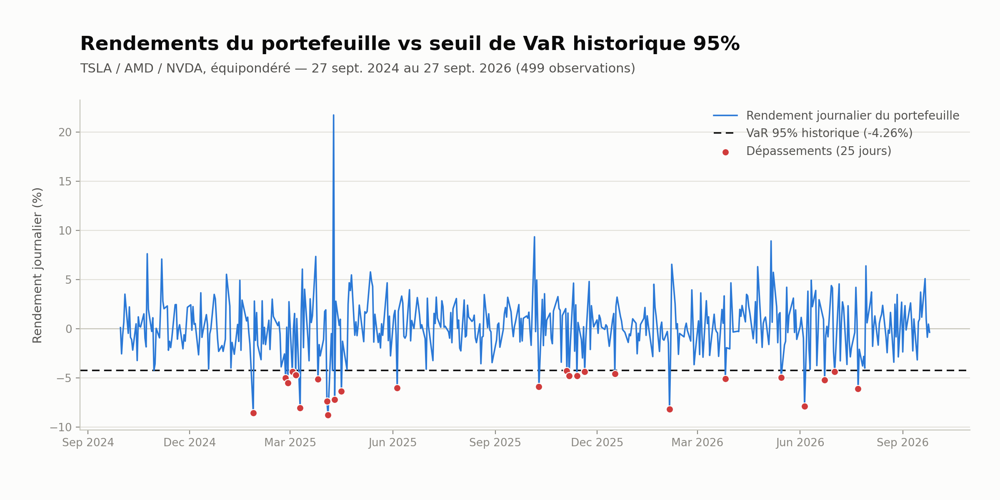

# Analyse de Risque de Portefeuille — Value at Risk (VaR)

Implémentation et comparaison de 4 méthodes de calcul de la Value at Risk sur un portefeuille actions (TSLA, AMD, NVDA), avec validation empirique par backtesting.

## Le projet

La VaR répond à une question centrale en gestion des risques : *"quelle est la perte maximale probable de mon portefeuille, sur un horizon donné, avec un certain niveau de confiance ?"*

Ce projet implémente et compare 4 approches, sur un portefeuille équipondéré de 3 valeurs technologiques (Tesla, AMD, Nvidia), à partir de 2 ans de données réelles (499 jours de bourse) :

- **VaR historique** — 5e percentile des rendements observés, sans hypothèse de distribution
- **VaR paramétrique** — hypothèse de loi normale (`VaR = μ + z × σ`)
- **VaR Monte Carlo** — 100 000 scénarios simulés à partir de la matrice de covariance
- **VaR Monte Carlo (bootstrap)** — ré-échantillonnage direct des rendements historiques

Le modèle est ensuite validé par **backtesting** : on vérifie que le taux de dépassement réel du seuil de VaR correspond au taux théorique attendu.

## Résultats clés

| Méthode | VaR 95% (1 jour) | VaR 99% (1 jour) |
|---|---|---|
| Historique | -4.26% | -7.40% |
| Paramétrique | -4.41% | -6.32% |
| Monte Carlo (normal) | -4.42% | — |
| Monte Carlo (bootstrap) | -4.25% | — |

**Backtesting** : 25 dépassements observés sur 499 jours (5,01%), quasiment identique au taux théorique de 5,00% — le modèle est bien calibré.

Les 4 méthodes convergent à 95% (écart maximal de 0,2 point), mais l'écart se creuse nettement à 99% (-7,40% vs -6,32%), illustrant une limite connue de l'hypothèse de loi normale : elle sous-estime la fréquence des pertes extrêmes ("queues épaisses").

Ce graphique révèle aussi un phénomène de **clustering de volatilité** : les dépassements ne sont pas uniformément répartis dans le temps, mais concentrés sur certaines périodes — une limite du calcul de VaR statique, qui ne capture pas les variations de régime de volatilité.

## Fichiers

| Fichier | Description |
|---|---|
| `VaR_Portefeuille_TSLA_AMD_NVDA.ipynb` | Notebook Python complet (récupération des données, 4 méthodes de VaR, backtesting, visualisation) |
| `Analyse_Risque_VaR_Portefeuille.pdf` | Dossier méthodologique complet (contexte, théorie, résultats, limites, annexe données) |
| `visuel_var.png` / `timeline_var.png` | Visualisations de synthèse |

## Outils

Python (pandas, numpy, scipy.stats, matplotlib), Google Colab.

## Limites et pistes d'amélioration

- La VaR ne renseigne pas sur l'ampleur des pertes au-delà du seuil — l'**Expected Shortfall** serait un complément naturel
- L'hypothèse de volatilité constante ne capture pas le clustering observé — un modèle **GARCH** permettrait de faire varier la VaR dans le temps
- Le portefeuille suppose un rééquilibrage quotidien parfait à poids égaux

---
*Projet réalisé dans le cadre d'une recherche de stage/alternance en finance de marché (gestion des risques, front office, produits structurés).*
