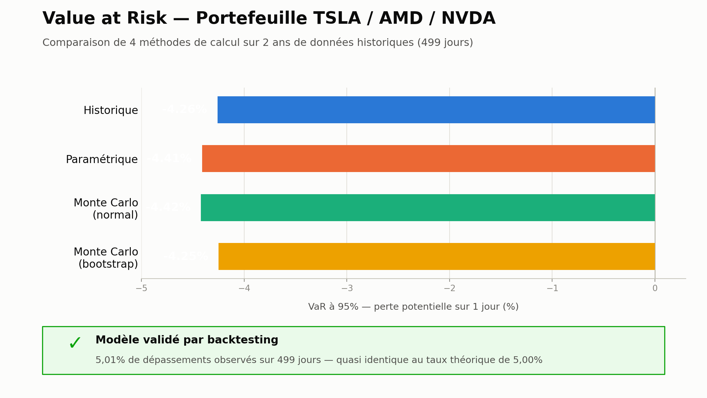

# Value at Risk d'un portefeuille — 4 méthodes et backtest hors échantillon

Calcul de la VaR à 1 jour d'un portefeuille équipondéré de trois valeurs technologiques (TSLA, AMD, NVDA) par quatre méthodes (historique, paramétrique, Monte Carlo normal, Monte Carlo bootstrap), puis validation par un backtest hors échantillon en fenêtre glissante et un test de Kupiec.

## Le projet

La Value at Risk (VaR) est l'indicateur standard de risque de marché : la perte maximale qu'un portefeuille ne devrait pas dépasser en un jour avec un niveau de confiance donné (95 % ou 99 %). Plusieurs méthodes existent, avec des hypothèses différentes sur la forme de la distribution des rendements. Ce projet les implémente, les compare, puis les teste sur des données que le modèle n'a pas vues.

Le portefeuille est volontairement volatil (Tesla, AMD, Nvidia, poids égaux, 499 rendements journaliers du 27 septembre 2024 au 27 septembre 2026), pour obtenir des résultats de VaR significatifs.

## Résultats clés

| Méthode | VaR 95 % (1 jour) | VaR 99 % (1 jour) |
|---|---|---|
| Historique | -4,26 % | -7,40 % |
| Paramétrique (loi normale) | -4,41 % | -6,32 % |
| Monte Carlo (normal) | -4,42 % | — |
| Monte Carlo (bootstrap) | -4,25 % | — |

Backtest hors échantillon (VaR recalculée chaque jour sur les 250 jours précédents, 249 jours testés) :

| Confiance | Dépassements | Taux observé | Taux attendu | LR (Kupiec) | p-value | Verdict |
|---|---|---|---|---|---|---|
| 95 % | 12 / 249 | 4,82 % | 5 % | 0,017 | 0,895 | Non rejeté |
| 99 % | 3 / 249 | 1,20 % | 1 % | 0,099 | 0,753 | Non rejeté |

Les résultats sont identiques pour la méthode historique et la méthode paramétrique (même nombre de dépassements sur cet échantillon).

**À 95 %, les quatre méthodes convergent** (entre -4,25 % et -4,42 %). **À 99 %, la VaR historique (-7,40 %) est nettement plus sévère que la paramétrique (-6,32 %)** : la loi normale sous-estime la probabilité des gros mouvements, c'est l'effet des queues épaisses des rendements d'actions.

**Une limite identifiée puis corrigée.** Le premier backtest comptait les rendements passant sous le 5e percentile de ces mêmes rendements : environ 5 % de dépassements par construction (25 sur 499), donc aucune validation réelle. Il a été remplacé par une fenêtre glissante de 250 jours, décalée d'un jour pour éviter le biais de look-ahead, et complété par le test de Kupiec. Le modèle n'est pas rejeté, mais avec 249 jours le test a peu de puissance, surtout à 99 % : le résultat signifie « pas de preuve que le modèle est mauvais », pas « modèle validé ».

## Fichiers

| Fichier | Description |
|---|---|
| `Analyse_Risque_VaR_Portefeuille.pdf` / `.docx` | Dossier méthodologique (7 pages) : méthodes, code, résultats, limites |
| `visuel_var.png`, `timeline_var.png` | Comparaison des méthodes et rendements du portefeuille avec dépassements |
| `prix_actions.csv`, `rendements.csv`, `portfolio_returns.csv` | Données utilisées (prix de clôture, rendements, rendements du portefeuille) |

## Outils

Python (pandas, numpy, scipy, matplotlib), yfinance, notebook Google Colab.

## Limites et pistes d'amélioration

- Le test de Kupiec ne vérifie que le nombre de dépassements, pas leur répartition dans le temps ; les dépassements sont groupés en périodes de forte volatilité (clustering). Le test de Christoffersen (indépendance) serait le complément naturel.
- Volatilité supposée constante dans la fenêtre ; un modèle EWMA ou GARCH ferait varier la VaR selon le régime de marché.
- La VaR ne mesure pas l'ampleur des pertes au-delà du seuil : l'Expected Shortfall serait un complément naturel.
- 249 jours de test : puissance statistique limitée, surtout à 99 % ; une période plus longue, couvrant plusieurs régimes, renforcerait la conclusion.
- Portefeuille de 3 valeurs technologiques corrélées, avec rééquilibrage quotidien parfait supposé : peu de diversification, résultats non généralisables.

---
*Projet réalisé dans le cadre d'une recherche de stage/alternance en finance de marché (risk management, front office).*
